# ROS2 Perception - The Construct Sim

## Tooling: OpenCV, PCL, YOLO

## Unit 5: Human Robot Interaction
Exploring the use of perception to interface a robot with humans in its environment

Throughout these exercises, Haar cascade XML files are used as the OpenCV provided pre-trained classifiers 

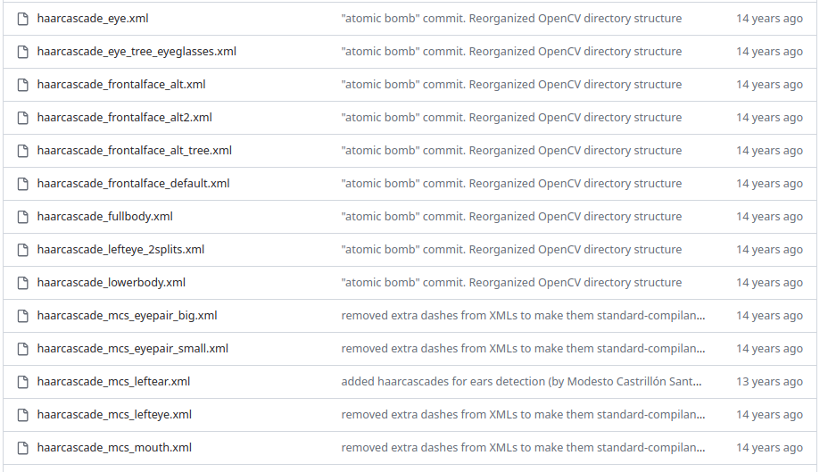

In this first exercise, a ROS node detects the people's faces and eyes

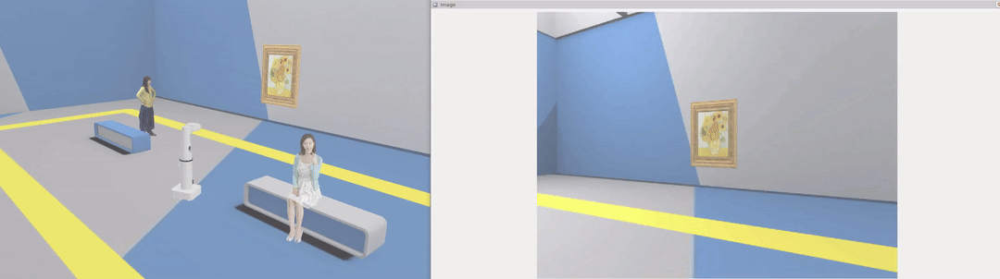

In this second exercise, a ROS node detects and recognizes a persons face as opposed to a mona lisa painting face

In this final exercise, a ROS node identifies and follows a standing person, rotating the robot's heading to face them

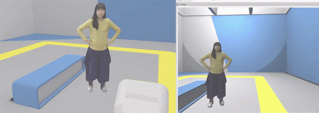

## Unit 6: YOLO
Exploring the functionality of YOLO through some use cases

")

Throughout this coursework, I strictly use the YOLOv8n model trained on the COCO dataset

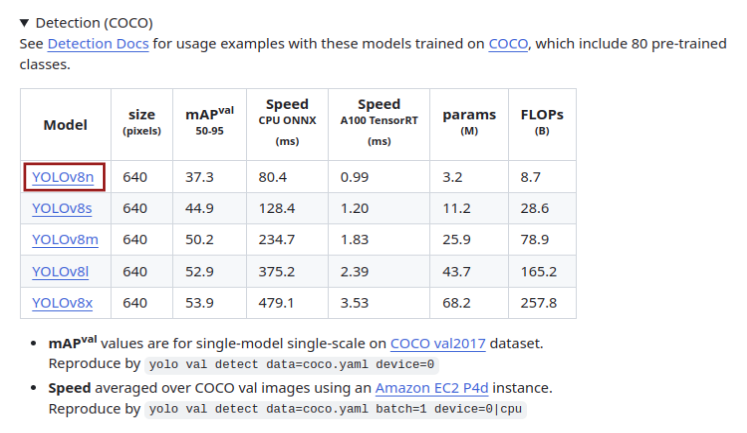

In the first exercise, a node running YOLOv8n detects and navigates to a banana and an apple it classified on a countertop

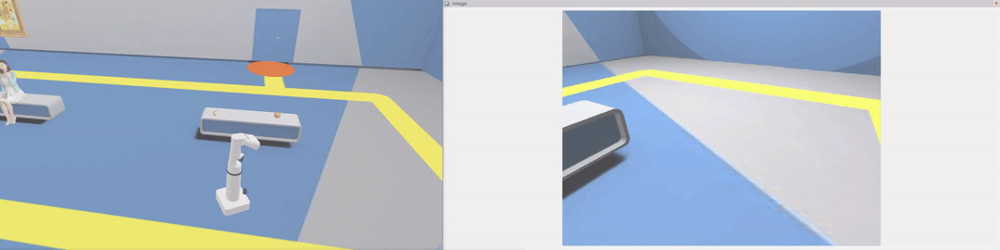

In the second exercise, a node running YOLOv8n detects a sitting person and navigates the robot to them by centering them in frame (through heading of robot)

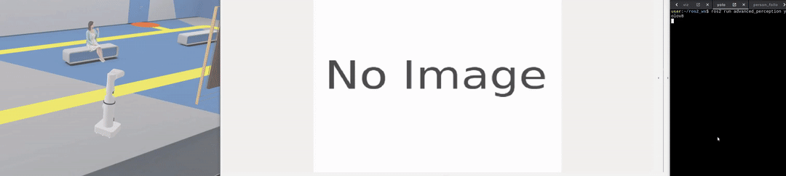

In the third exercise, a node running YOLOv8n detects a standing person and defines a wireframe posture of their connected joints (a pose estimation)

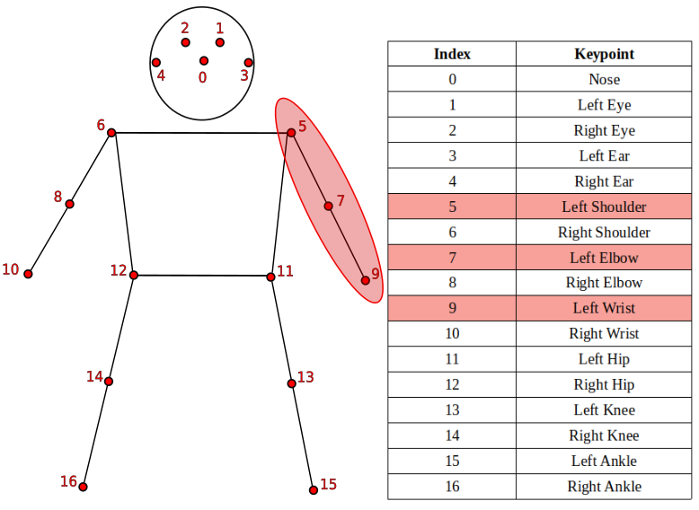

In this final exercise, a node running YOLOv8n identifies classes of fruit and generates segmentation masks

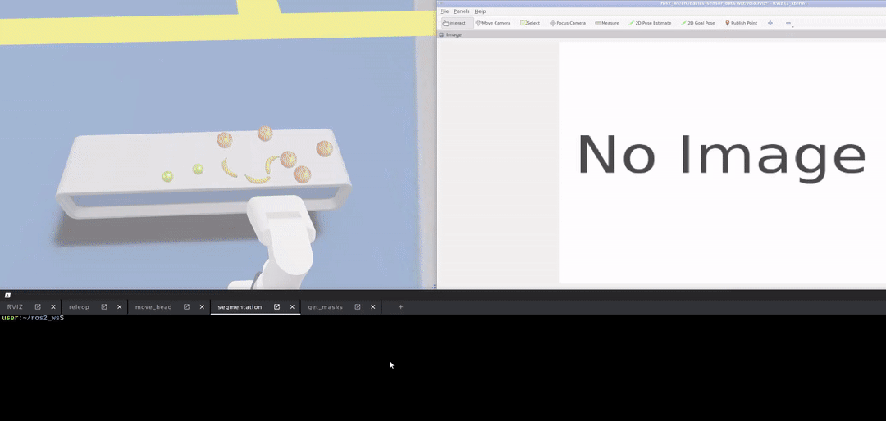
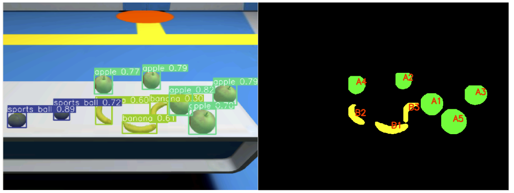

## Unit 7: Final Project
Putting it all together to navigate shelving and count classes of inventory

In this capstone, I navigate the robot to marked locations with stocked inventory to be counted

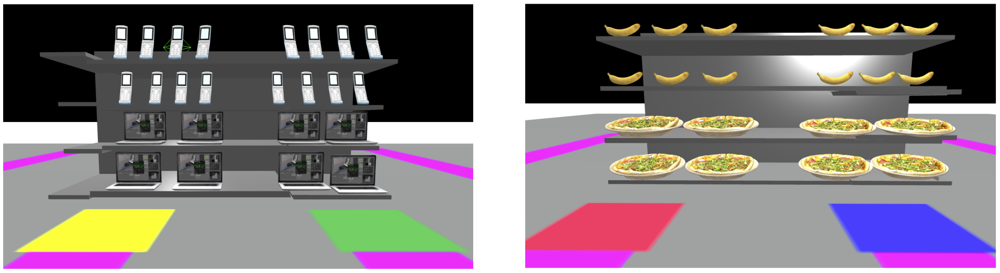

The robot can tilt its head to use a YOLOv8n model for classification of objects and counting of different classes

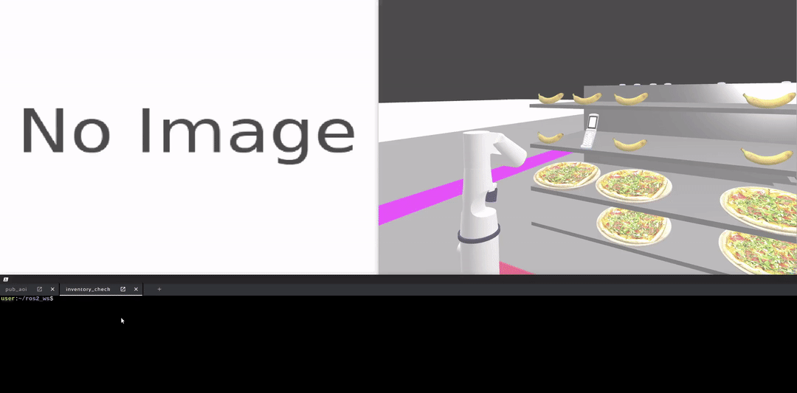