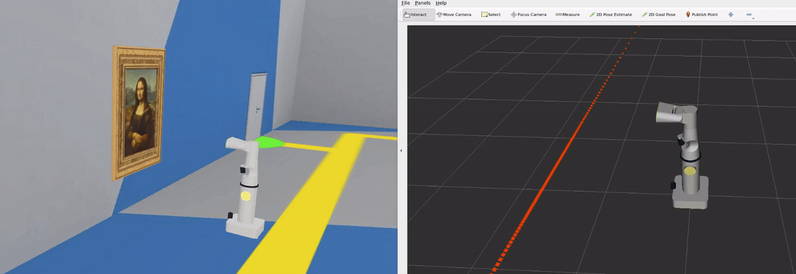
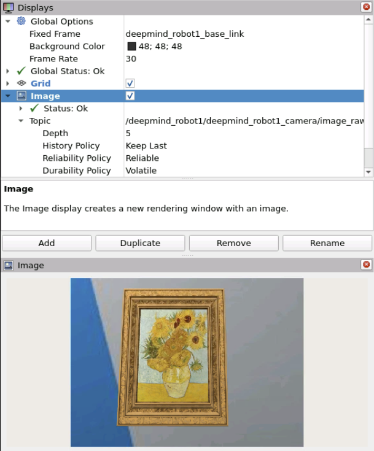
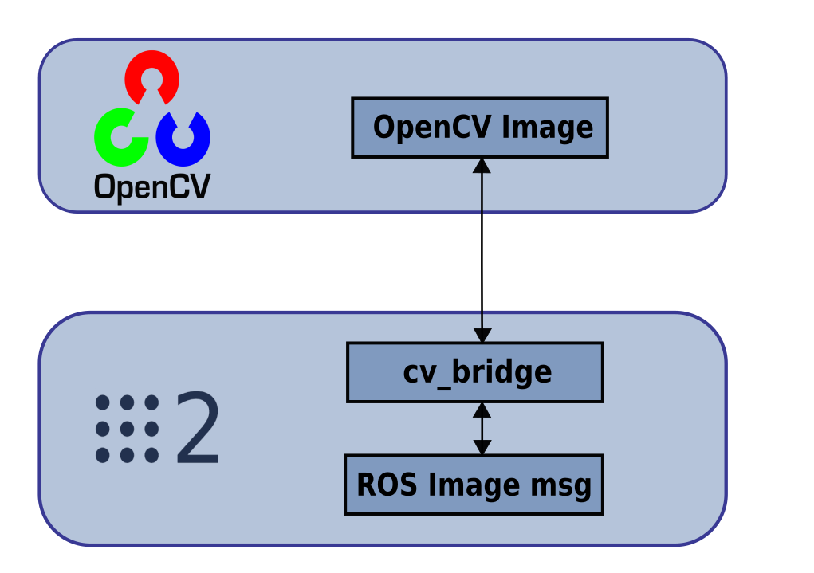
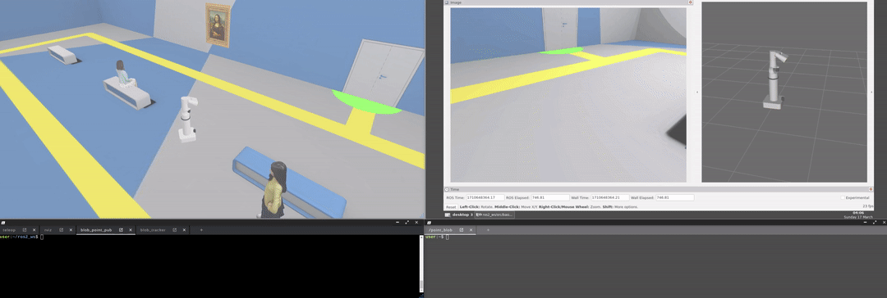
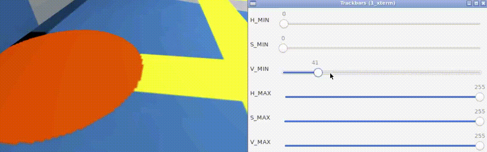
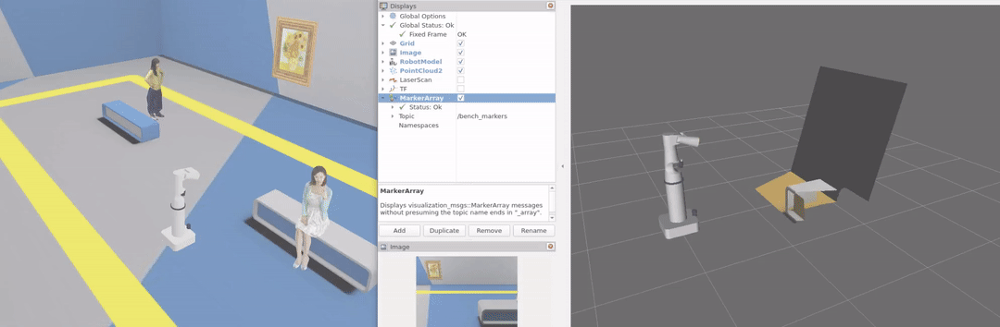

# ROS2 Perception - The Construct Sim

## Tooling: OpenCV, PCL, YOLO

## Unit 3: Visualization
Exploring RViz2 for visualization of sensor message types

In the first exercise, we visualize the 2D Lidar data as laser scan msgs

In the second exercise, we visualize the camera data as Image msgs

In the final exercise, we append markers to visualize 3D lidar data in RViz2

## Unit 3: Image Processing
Exploring the use of open-Computer-Vision (openCV) for robotics use cases

This section makes extensive use of the cv_bridge to convert cv::Mat matrices of images from OpenCV into sensor_msgs.msg.Image data for ROS2

In the first exercise, the robot rotates heading until it finds an orange blob, and it navigates to it

The HSV min-max ranges for the orange blob were identified using a ranging tool provided

In the second exercise, a line follower is created by analyzing and manipulating yaw to track the centroid of the yellow blob (line) on the ground

In the third exercise, the line follower is improved by adding functionality to handle scenarios of multiple centroids by prioritizing an appropriate centroid based on continuing on the rotational path

In the final exercise, a ROS subscriber is appended to the line follower to read a color choice and navigate the robot to the corresponding door

## Unit 4: Point Cloud Processing
Exploring the use of point cloud library (PCL) for robotics use cases

In the first exercise, a ROS node using PCL detects the surface of the bench and isolates the point cloud detections defining the surface

In the second exercise, a ROS node using PCL detects the bench and a cube over it, and isolates the point cloud detections for each as indexed objects with poses 

")

## Unit 5: Human Robot Interaction
Exploring the use of perception to interface a robot with humans in its environment

Throughout these exercises, Haar cascade XML files are used as the OpenCV provided pre-trained classifiers 

In this first exercise, a ROS node detects the people's faces and eyes

In this second exercise, a ROS node detects and recognizes a persons face as opposed to a mona lisa painting face

In this final exercise, a ROS node identifies and follows a standing person, rotating the robot's heading to face them

## Unit 6: YOLO
Exploring the functionality of YOLO through some use cases

")

Throughout this coursework, I strictly use the YOLOv8n model trained on the COCO dataset

In the first exercise, a node running YOLOv8n detects and navigates to a banana and an apple it classified on a countertop

In the second exercise, a node running YOLOv8n detects a sitting person and navigates the robot to them by centering them in frame (through heading of robot)

In the third exercise, a node running YOLOv8n detects a standing person and defines a wireframe posture of their connected joints (a pose estimation)

In this final exercise, a node running YOLOv8n identifies classes of fruit and generates segmentation masks

## Unit 7: Final Project
Putting it all together to navigate shelving and count classes of inventory

In this capstone, I navigate the robot to marked locations with stocked inventory to be counted

The robot can tilt its head to use a YOLOv8n model for classification of objects and counting of different classes

